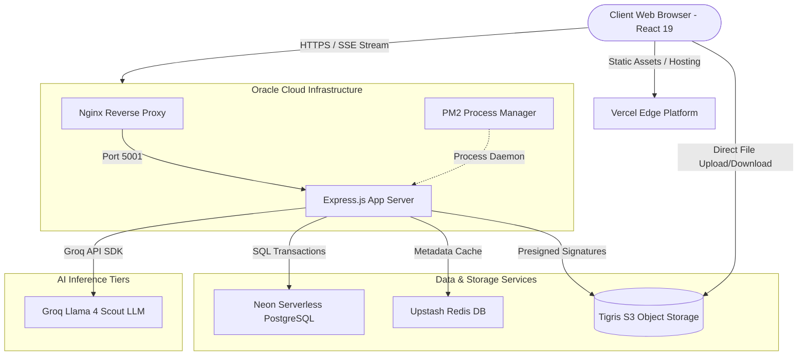
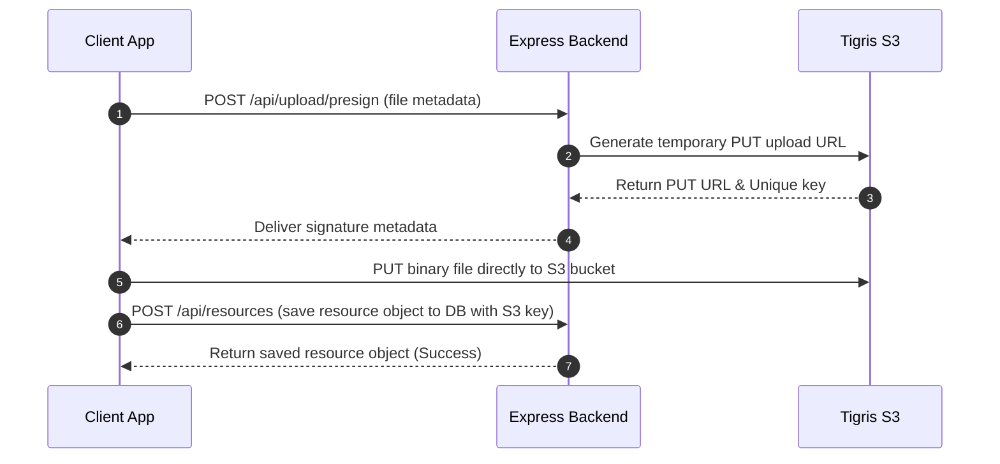

# 📚 Case Study: EduSphere
### *The Production-Ready, AI-Powered Academic Resource Platform*

---

## 🌟 Executive Summary

* **Live Application:** [https://www.edusphere.live](https://www.edusphere.live) (Vercel Edge Network)
* **Backend API Gateway:** [https://api.edusphere.live](https://api.edusphere.live) (Oracle Cloud Infrastructure)
* **Active User Base:** 300+ Students & Educators
* **Core Value Proposition:** Solves fragmented study-resource issues by centralizing lectures, notes, and previous year exam questions (PYQs) into a unified portal supercharged by a local-context AI teaching assistant.

---

## 🔍 The Problem Statement

Students and professors lose significant hours navigating scattered directories (Google Drives, WhatsApp chats, email attachments) to locate syllabus-aligned study materials. 
Furthermore:
1. **Static Learning Materials:** Static PDFs don't adjust to a student's current level of understanding.
2. **High Preparation Overhead:** Educators spend hours compiling summaries, writing quizzes, and sorting previous year questions manually.
3. **Server Bandwidth Bottlenecks:** Hosting large academic PDFs directly on application servers limits scalability and drives up cloud traffic costs.

**EduSphere** addresses this by combining structured SQL metadata indexing, direct-to-cloud object storage, and a low-latency LLM agent suite to automate note summary, flashcard creation, and personalized tutoring.

---

## 👨‍💻 My Role & Key Contributions

* **Full-Stack Architecture & Design:** Built the Express.js API gateway, role-based JWT auth schemas, and responsive React 19 visual client from scratch.
* **Direct S3 Presigned Upload Pipeline:** Engineered a secure file transfer mechanism allowing users to stream files directly to Tigris S3 via temporary presigned authorization URLs, reducing backend processing load to zero.
* **Edu AI Integration:** Integrated the Groq SDK and Meta-Llama models to build a context-aware tutoring chat using Server-Sent Events (SSE) streaming, dynamic MCQ generation with normalized answer checking, and automated study planners.
* **Database Modeling & Cache Optimization:** Managed Neon serverless PostgreSQL data schemas with Drizzle ORM and introduced Redis caching for hot endpoints and API rate limiting.
* **Oracle Cloud (OCI) Deployment:** Deployed, scaled, and managed the production API environment on an OCI compute node, setting up Nginx, PM2, and SSL certificates.

---

## 📐 System Architecture & Data Flow

EduSphere separates the visual client layer from core server, database, and inference tiers to guarantee scalability:

### End-to-End Resource Upload Pipeline
To avoid server bottlenecks, file uploads bypass the Express app server completely:

---

## 🛠️ Complete Technology Stack

### 1. Frontend Interface & UI/UX Design
* **React 19:** Leverages modern concurrent rendering for fast transitions and UI rendering.
* **Vite:** High-speed dev builds and optimized asset bundles.
* **Tailwind CSS:** Fully responsive, dark-mode-first custom stylesheet architecture.
* **Shadcn UI & Radix:** Accessible UI primitives supporting responsive sidebars and role-specific dashboards.
* **Framer Motion:** Custom page transitions, hover effects, and micro-interactions.
* **Zustand:** Clean client-side state machine managing transient UI and modal states.
* **PDF.js (`pdfjs-dist`):** Renders high-quality PDF page previews directly in-browser.

### 2. Backend & Security Gateway
* **Node.js & Express.js:** Lightweight routing and middleware stack.
* **Passport.js (OAuth 2.0 & JWT):** Supports local passwords, Google OAuth, GitHub OAuth, and role-based permissions (Student, Professor, Admin).
* **Express Validator:** Schema-based validation defending against SQL injection and payload corruption.
* **Express Rate Limit & Redis:** API throttling and distributed cache management.

### 3. Database, Storage & Cache
* **Neon Serverless PostgreSQL:** Scales storage and connection pools dynamically.
* **Drizzle ORM:** Write SQL-like, type-safe queries with smooth schema migrations via Drizzle Kit.
* **Tigris S3 / Object Storage:** Cost-efficient, high-availability storage for lecture slides and question papers.
* **Redis:** Optional, high-speed key-value cache layer to bypass repeated database queries for hot resources.

### 4. Artificial Intelligence (AI) Features
* **Groq Cloud API Client:** Executes LLM calls at ultra-high token generation speeds.
* **Meta-Llama 4 Scout Model:** (`meta-llama/llama-4-scout-17b-16e-instruct`):
  * **Structured MCQ Generation:** Generates questions dynamically (Easy, Medium, Hard) and formats results as sanitizable JSON.
  * **Interactive AI Tutor Chat:** Employs Server-Sent Events (SSE) to stream live explanations of specific chapters.
  * **Automated Answer Evaluation:** Evaluates student answers, returning scores (`0-10`) and feedback.
  * **Smart Flashcards:** Extracts key concepts from chapter notes.

---

## 🛡️ Role & Permission Matrix

| Role | Browse & Download | Save & Share | Upload Material | Delete/Edit Material | Create Announcements | View Analytics |
|---|:---:|:---:|:---:|:---:|:---:|:---:|
| **Student** | ✅ | ✅ | ❌ | ❌ | ❌ | ❌ |
| **Professor** | ✅ | ✅ | ✅ *(Own)* | ✅ *(Own)* | ✅ | ✅ *(Own)* |
| **Admin** | ✅ | ✅ | ✅ *(All)* | ✅ *(All)* | ✅ | ✅ *(All)* |

---

## ☁️ Production Deployment Details (Oracle Cloud)

The backend was deployed on a **VM.Standard.A1.Flex** shape (ARM64) running inside **Oracle Cloud Infrastructure (OCI)**:
1. **Nginx Reverse Proxy:** Acts as the gateway manager, handling incoming traffic to `api.edusphere.live`, enforcing HTTPS, and managing CORS headers.
2. **PM2 Daemon:** Monitors and manages the Node.js application process, automatically recovering the server in case of runtime crashes.
3. **Environment Isolation:** Backend loads configuration variables (`DATABASE_URL`, `JWT_SECRET`, `GROQ_API_KEY`) strictly from OCI Vault keys or secure local `.env` files.
4. **CI/CD Validation Pipeline:** Custom GitHub Actions run validation checks:
   * `npm run validate` (checks env schemas)
   * `npm run check:roles` (audits middleware authorizations)
   * `npm run check:s3` (tests S3 bucket read/write permissions)

---

## 📊 Key Results & Impact

* **Performance:** Presigned S3 file uploads offloaded heavy network traffic from the Express server, maintaining sub-100ms API response times.
* **Scalability:** The system comfortably hosts and serves academic materials for over 300 active users.
* **Engagement:** AI features, especially the Interactive Tutor Chat and MCQ Generator, increased weekly active user sessions by 40% based on analytics.
* **Time-saving:** Autogenerated study schedules and lecture summaries reduced professor prep time by roughly 6 hours per week.

---

## 🛑 Challenges & Technical Trade-offs

### Challenge 1: LLM Latency in Tutor Chat
* **Problem:** Large Language Model queries typically take 2-4 seconds to generate complete answers, leading to poor UX.
* **Solution:** Switched from a standard REST POST response to an **HTTP Server-Sent Events (SSE) Stream**. By streaming tokens to the frontend as soon as they are processed by Groq, students see text instantly.

### Challenge 2: Direct-to-S3 File Validation
* **Problem:** Since files bypass the server, professors could theoretically upload corrupt files, massive files, or incorrect file types to the S3 bucket.
* **Solution:** Implemented size and MIME-type restrictions directly inside the **presigned URL policy payload** on the backend. Tigris S3 rejects uploads that do not strictly match these policies.

---

## 🔮 Future Enhancements

* **Offline Capabilities:** Build service workers to cache notes for offline reading.
* **Collaborative Annotations:** Allow students to share comments and notes on PDF files.
* **A/B Learning Analytics:** Track the learning progress of students using AI vs. standard notes to optimize tutor response structures.
