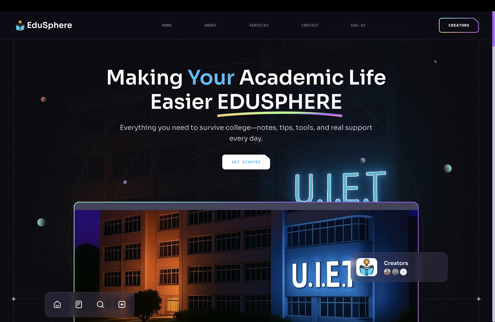
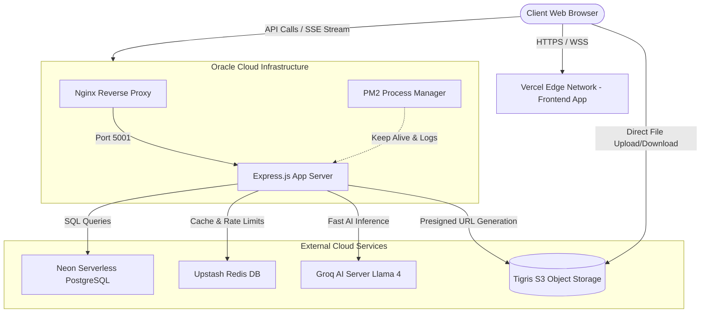
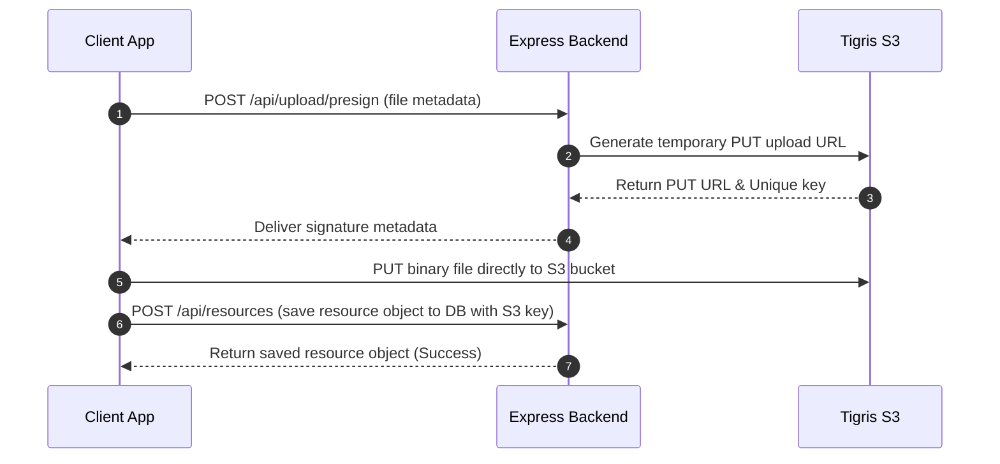

# 📚 EduSphere — Academic Resource Platform

> Making Your Academic Life Easier — notes, tips, tools, and real support every day.

🌐 **Live Application:** [https://www.edusphere.live](https://www.edusphere.live)  
⚡ **Backend API Gateway:** [https://api.edusphere.live](https://api.edusphere.live)



EduSphere is a production-ready, modular academic resource platform that centralizes essential university study materials and enhances the learning experience using an integrated, context-aware AI tutor suite.

### 🌟 What EduSphere Does (Key Features)
* **Centralized Materials:** Instantly find, view, and download structured course notes, lecture references, and Previous Year Questions (PYQs).
* **Interactive AI Tutor Chat:** Real-time stream-rendered (SSE) dialogue that walks you through chapter topics step-by-step and checks your understanding with custom questions.
* **Automated Study-Aid Generation:** Auto-generates high-quality multiple-choice questions (MCQs) and smart flashcards directly from notes based on selected difficulty levels (Easy, Medium, Hard).
* **Smart Answer Grading:** Evaluates student written answers on a `0-10` scale and returns precise qualitative feedback using exam guides.
* **Role-Based Access Portals:** Provides dedicated dashboards for Students (to browse and save content), Professors (to upload resources and inspect upload-specific analytics), and Admins (to oversee users).

### 🛠️ Technology Stack & Purpose

| Technology | Category | Purpose / Why We Used It |
| :--- | :--- | :--- |
| **React 19** | Frontend | Powers a fast Single Page Application (SPA) with concurrent rendering hooks. |
| **Vite** | Build Tool | Serves the project with instant HMR and builds highly-optimized static files. |
| **Tailwind CSS** | Styling | Simplifies responsive design and enables a sleek, custom dark-theme visual style. |
| **Shadcn UI & Radix** | UI Library | Supplies accessible, customizable design blocks like panels, modals, and dropdowns. |
| **Framer Motion** | Animation | Animates transitions and hover effects to provide an organic, premium interface. |
| **Zustand** | State Management | Holds simple, reactive client-side state hooks (such as authentication state). |
| **PDF.js (`pdfjs-dist`)**| Document Rendering| Allows in-browser PDF parsing to extract page contents and show previews. |
| **Node.js & Express** | Backend Gateway | Runs the API, route controllers, middleware checks, and error boundaries. |
| **Passport.js** | Authentication | Coordinates secure local login alongside Google and GitHub OAuth 2.0 logins. |
| **Neon PostgreSQL** | Database | Stores structured records for users, subjects, saved items, and announcements. |
| **Drizzle ORM** | Database Mapping | Ensures type-safe queries and manages DB schemas with Drizzle Kit. |
| **Tigris S3** | Object Storage | Stores lecture documents and PDF resources using pre-signed direct client uploads. |
| **Groq Cloud API** | AI Inference | Grants ultra-low latency access to open-weights LLMs. |
| **Meta-Llama 4 Scout** | LLM Engine | Drives AI features including live SSE tutoring, grading, and MCQ generations. |
| **Upstash Redis** | Caching & Security | Handles distributed endpoint rate-limiting and caches expensive query returns. |
| **Oracle Cloud (OCI)** | Host Cloud | Runs the production backend app process behind an SSL-secured Nginx reverse proxy. |

---

## 📐 System Architecture Diagram



---

## 📁 Project Structure

```
Edusphere/
├── backend/                  # Express.js API server
│   ├── src/
│   │   ├── ai/               # AI Controllers, custom Parsers & Groq Client
│   │   ├── analytics/        # Professor & platform analytics
│   │   ├── auth/             # JWT utility strategies
│   │   ├── config/           # Passport & S3 configurations
│   │   ├── db/               # Neon + Drizzle client/schema
│   │   ├── controllers/      # Route controllers
│   │   ├── middleware/       # Auth, role, and legacy protections
│   │   ├── routes/           # Express routers
│   │   └── services/         # S3 service, slug service
│   ├── schema.sql            # PostgreSQL schema (Neon compatible)
│   ├── drizzle.config.js     # Drizzle Kit configuration
│   ├── .env.example
│   └── package.json
│
├── frontend/                 # React + Vite + Tailwind
│   └── src/
│   │   ├── ai/               # React AI layout, routes, pages, and components
│   │   ├── context/          # AuthContext (global authentication state)
│   │   ├── dashboard/        # StudentDashboard, ProfessorDashboard, AdminDashboard
│   │   ├── hooks/            # useResources, useUpload hooks
│   │   ├── Pages/            # Login, Signup, ProfessorPin, AuthCallback
│   │   ├── services/         # api.js, auth.service, resource.service
│   │   └── components/       # ProtectedRoute, Header, navigation components
│
└── .github/
    └── scripts/              # Automated verification pipelines
        ├── validate-env.js
        ├── check-roles.js
        ├── check-slug-format.js
        ├── verify-permissions.js
        ├── verify-s3-config.js
        └── setup-check.js
```

---

## 🔑 Authentication System

| Authentication Method | Flow Description |
|---|---|
| **Email/Password** | Signup/Login triggers JSON Web Token (JWT) returns containing encrypted user payloads. |
| **Google OAuth 2.0** | Redirects to Google Login Consent screen $\rightarrow$ backend callback parses state $\rightarrow$ signs JWT. |
| **GitHub OAuth 2.0** | Redirects to GitHub Authorization $\rightarrow$ maps access tokens to user schemas $\rightarrow$ signs JWT. |
| **Professor PIN Access**| Standard authentication returns `pin_required: true`. User must verify via `/auth/verify-pin` to unlock elevated JWT claims. |

> **Admin Auto-Detection:** Logged-in accounts matching `ADMIN_EMAIL` in the secure environment are dynamically reassigned the `admin` role on login.

---

## 🛡️ Role & Permission Matrix

| Operation | Student | Professor | Admin |
|---|:---:|:---:|:---:|
| **View, Preview & Download Resources** | ✅ | ✅ | ✅ |
| **Save & Share Resources** | ✅ | ✅ | ✅ |
| **Upload PDFs & YouTube Lecture links** | ❌ | ✅ *(Own uploads)* | ✅ |
| **Upload Legacy Google Drive Links** | ❌ | ❌ | ✅ |
| **Edit/Delete Own Uploaded Material** | ❌ | ✅ | ✅ |
| **Edit/Delete Any Material Globally** | ❌ | ❌ | ✅ |
| **Create/Post Global Announcements** | ❌ | ✅ | ✅ |
| **Add New Branches/Subjects** | ❌ | ✅ | ✅ |
| **User Administration & Accounts Management** | ❌ | ❌ | ✅ |
| **Access Usage & Content Analytics** | ❌ | ✅ *(Own content)* | ✅ *(Platform-wide)* |

---

## 📦 File Upload System (Tigris S3 Presigned URL Flow)

To keep server processes non-blocking and fast, client uploads stream directly to Tigris S3 via secure, short-lived signatures:



---

## 🚀 Quick Setup Instructions

### 1. Clone the Codebase & Install Packages
```bash
# Backend installation
cd backend
npm install

# Frontend installation
cd ../frontend
npm install
```

### 2. Configure Local Environment
Copy the example configs and populate the values:
```bash
cp .env.example backend/.env
```

Ensure your `.env` contains:
* **Neon PostgreSQL:** Connection string as `DATABASE_URL`
* **JWT Secret Keys:** Multiple 32-character keys
* **Google & GitHub Credentials:** Client IDs and Secrets
* **Tigris S3 Access Keys:** Access keys, endpoint URL, and bucket identifiers
* **Groq API Key:** For AI features

### 3. Initialize Database Schema
Copy and execute the contents of `backend/schema.sql` directly inside your Neon Console / PostgreSQL query runner.

### 4. Execute Verification Pipeline
Ensure everything is configured correctly:
```bash
node .github/scripts/setup-check.js
```

### 5. Launch the Local Development Cluster
```bash
# Terminal 1 — Start the API Gateway
cd backend && npm run dev

# Terminal 2 — Start the Client App
cd frontend && npm run dev
```

---

## 🧪 Automated Validation Pipeline

The platform uses custom scripts to audit environment rules and roles to safeguard production configurations:

| CLI Command | Purpose |
|---|---|
| `node .github/scripts/setup-check.js` | Runs all validation files recursively to audit full setup state. |
| `npm run validate` | Asserts that all environment variables conform to expected types. |
| `npm run check:roles` | Scans route configurations to verify role-based middleware coverage. |
| `npm run check:slug` | Runs checks against subject acronyms and validation rules. |
| `npm run check:s3` | Pings Tigris S3 endpoints to test credentials and read/write authorizations. |
